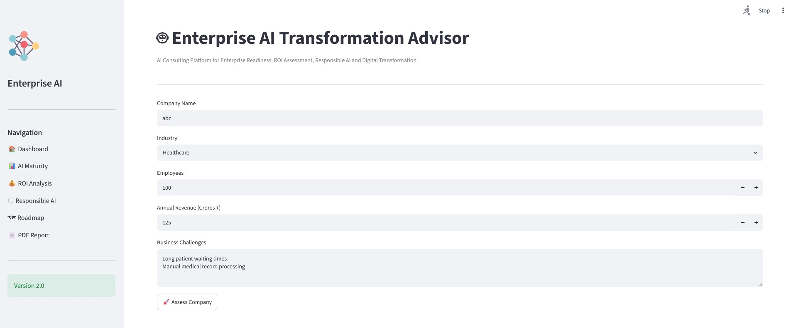
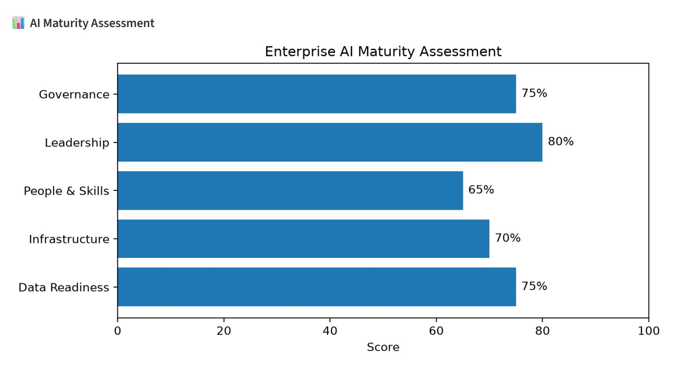
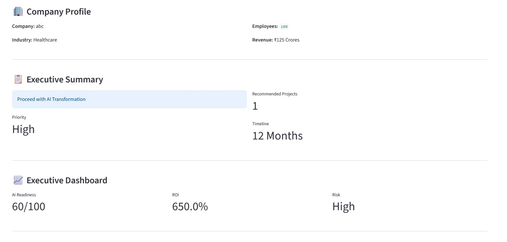

<<<<<<< HEAD
# 🤖 Enterprise AI Transformation Advisor

An end-to-end AI Consulting Platform that helps organizations evaluate their AI readiness, identify AI opportunities, estimate ROI, assess Responsible AI risks, and generate AI transformation roadmaps using Google Gemini AI.

---

## 📌 Features

- AI Readiness Assessment
- AI Maturity Assessment
- AI Opportunity Discovery
- ROI Estimation
- Responsible AI Risk Assessment
- AI Transformation Roadmap
- Executive Summary Dashboard
- Google Gemini AI Recommendations
- Professional PDF Report Generation

---

## 🛠 Technology Stack

- Python
- Streamlit
- Google Gemini API
- ReportLab
- Matplotlib
- Pandas
- Git

---

## 📊 Dashboard

(Add screenshot here)

---

## 📄 Sample Report

(Add PDF screenshot here)

---

## 🚀 Installation

```bash
git clone <repository-url>

cd Enterprise_AI_Transformation_Advisor

pip install -r requirements.txt

streamlit run app.py
```

---

## 📂 Project Structure

```
Enterprise_AI_Transformation_Advisor/

├── agents/
├── reports/
├── utils/
├── images/
├── app.py
├── requirements.txt
└── README.md
```

---

## 🎯 Future Enhancements

- Multi-industry benchmarking
- Power BI Integration
- Azure OpenAI Support
- AWS Bedrock Support
- User Authentication
- Database Integration

---

## 👨‍💻 Author

**Ranganath N**

M.Tech (AI & ML)

Python | Generative AI | Agentic AI | Responsible AI
=======
# Enterprise-AI-Transformation-Advisor
>>>>>>> b17f0a745b406fee19648c64182eaf36318d9e90

## 📷 Dashboard



---

## 📊 AI Maturity Assessment



---

## 📄 PDF Report

